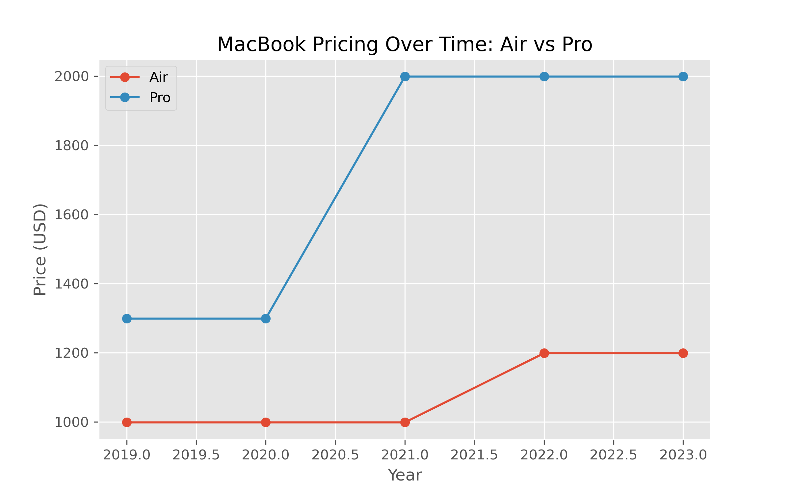
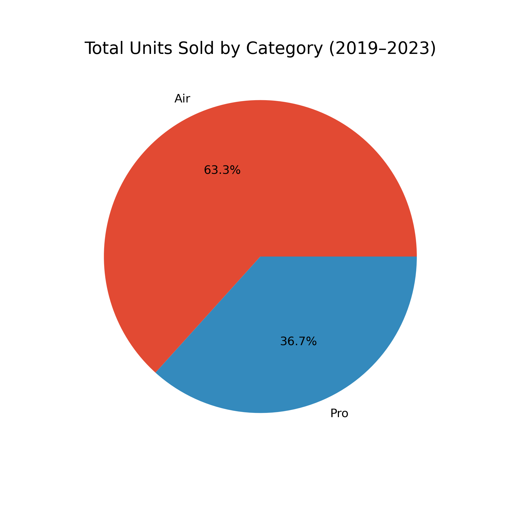
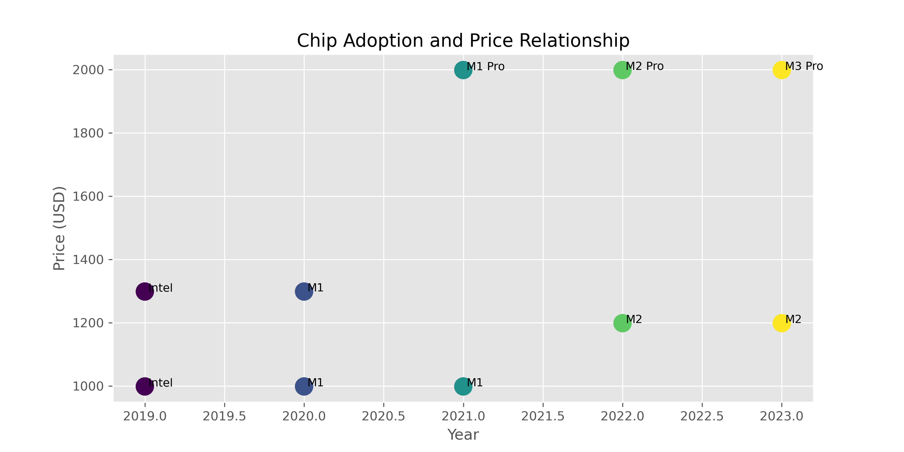

# MacBook Air vs MacBook Pro Analysis (2019–2023)

This project explores pricing trends, unit sales, and chip transitions across Apple's MacBook Air and MacBook Pro models between 2019 and 2023 to derive insightful product information.  
It combines data analytics, visualizations, and AI-generated insights using a local large language model (Mistral via Ollama).

---

## Project Overview

This project examines:

- Pricing changes between MacBook Air and Pro  
- Sales distribution by product line  
- Apple’s transition from Intel → M1 → M2 → M3 chips  
- Market segmentation between Air and Pro buyers  
- AI-generated executive summaries, personas, and strategy recommendations  

This blend of analytics + AI modeling demonstrates skills in:

- Python data analysis  
- Data visualization  
- AI/LLM integration  
- Business insight generation  
- Technical storytelling  

---

## Repository Structure

```
project-folder/
│
├── data/
│   └── macbook_data.csv
│
├── analysis/
│   └── macbook_analysis.ipynb
│
├── visuals/
│   ├── price_trends.png
│   ├── unit_share.png
│   └── chip_adoption.png
│
└── README.md
```

---

## Data Description

The dataset includes yearly observations for both MacBook Air and MacBook Pro models:

| Column | Description |
|--------|-------------|
| `model` | MacBook Air or Pro |
| `category` | “Air” or “Pro” classification |
| `year` | Year (2019–2023) |
| `price_usd` | Base price for that model and year |
| `units_millions` | Estimated units sold (in millions) |
| `chip` | Processor used (Intel, M1, M2, M3, etc.) |

---

## Key Visualizations

### 1. Price Trends (2019–2023)


### 2. Market Share by Units Sold


### 3. Chip Transition Overview


---

## AI-Generated Insights (Local LLM)

### Executive Summary

Over the analyzed period (2019–2023), MacBook pricing trends have shown a gradual increase across both Air and Pro models. While the MacBook Air has remained relatively more affordable, the MacBook Pro has seen larger price jumps following Apple's transition to custom M1, M2, and M3 chips.

Unit sales data indicate stronger demand for the MacBook Air, particularly among budget-conscious consumers and educational users.

Meanwhile, the MacBook Pro appeals to creative professionals and power users who require high performance and advanced features.

---

### Consumer Personas

**1. Typical MacBook Air Buyer**  
- **Demographic:** Students, trendy professionals, portability-focused users  
- **Motivations:** Lightweight design, everyday productivity  
- **Budget:** $999–$1,499  
- **Usage Patterns:** Web browsing, document editing, streaming, light creative work  
- **Why It Appeals:** Sleek design, battery life, value for money  

**2. Typical MacBook Pro Buyer**  
- **Demographic:** Creative professionals, developers, power users  
- **Motivations:** High performance for demanding tasks  
- **Budget:** $1,699–$3,599  
- **Usage Patterns:** Video editing, coding, 3D modeling, heavy workflows  
- **Why It Appeals:** Powerful processors, advanced graphics, professional-grade capabilities  

---

### Strategic Recommendations

1. **Introduce a More Affordable High-Performance Option**  
A lower-cost “MacBook Pro Lite” could capture budget-limited professionals needing performance without top-tier pricing.

2. **Upgrade Entry-Level MacBook Air Chips**  
Improving the Air's baseline chip would strengthen its appeal to both students and light professional users.

3. **Invest Further in Custom Silicon Innovation**  
Continued advancement in Apple Silicon (neural engine, efficiency, thermals) will maintain competitive advantage and drive stronger product segmentation.

---

## Conclusion

This project demonstrates how data analytics and local AI modeling can be combined to understand technology product trends.  
Using a fully offline LLM enhances the analysis with automated summaries, personas, and strategic insights.

---
